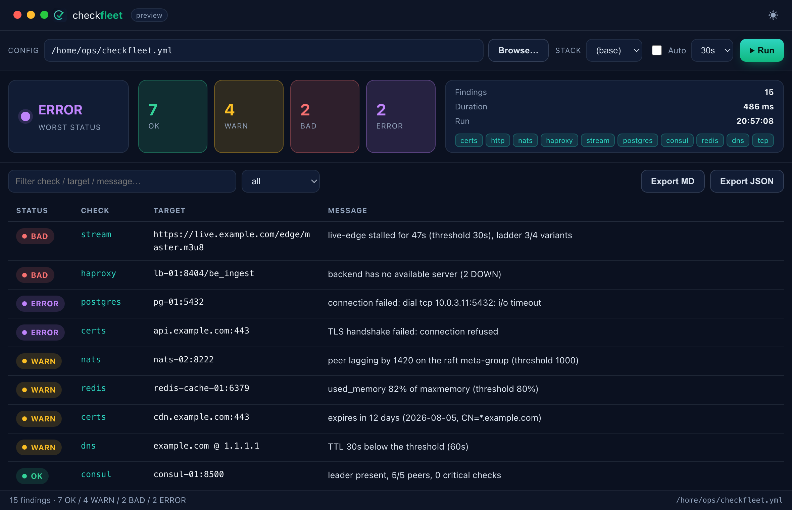
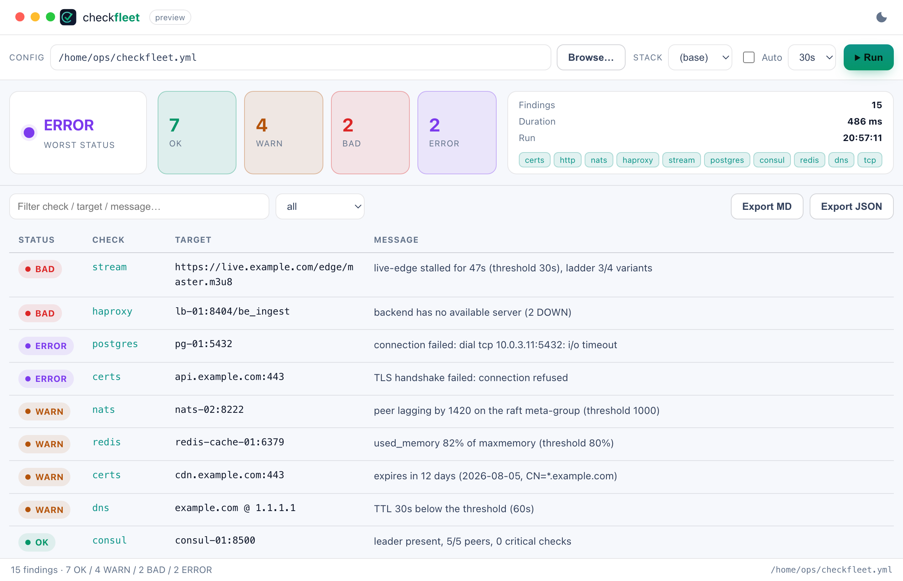

A small desktop GUI over the same engine as the CLI. It's a [Wails](https://wails.io)
app — a single native binary (macOS `.app`, Linux, Windows) with the web
frontend embedded — that **reuses `internal/engine`**: the checks, the
worst-first sort and the findings are identical to `checkfleet check all`. The
CLI stays the source of truth; the GUI is just another frontend.



## The fleet view

Everything is one screen, scanned top-to-bottom.

**Toolbar**

- **Config** — the `checkfleet.yml` to run. Type a path or **Browse…** for a
  native file picker.
- **Stack** — pick a `checkfleet.<stack>.yml` profile discovered next to the
  config (same overlay as the CLI's `--stack`); `(base)` runs the base file.
- **Auto** + interval — re-run the checks on a timer (10s / 30s / 60s / 5m).
- **Run** — execute every configured module now.

**Summary**

- The **worst status** pill (OK / WARN / BAD / ERROR) — the one thing to read
  first.
- Count tiles for **OK / WARN / BAD / ERROR**.
- Total findings, run **duration**, run time, and a chip per configured module.

**Findings table**

- One row per finding, **worst-first** (same order as the CLI), with a colored
  status badge and the `Status / Check / Target / Message` columns.
- **Filter** box — live substring match over check, target and message.
- **Severity** dropdown — show all, or only `≥ WARN`, `≥ BAD`, `ERROR`.

**Export**

- **Export MD** / **Export JSON** — save the current run as an ops-style
  Markdown report or JSON (the same renderers as `--output markdown|json`), via
  a native save dialog.

## Light theme

The theme toggle (top-right) switches light/dark and remembers your choice.



## Open straight into a fleet

Two environment variables let the app open on a config and run immediately —
handy for an "open with" launcher or a kiosk view:

```bash
CHECKFLEET_CONFIG=/etc/checkfleet.yml CHECKFLEET_AUTORUN=1 checkfleet-desktop
```

Without them the app opens on `./checkfleet.yml` (if present) and waits for you
to press **Run**.

## Get it

Every [release](https://github.com/Allan-Nava/checkfleet/releases) attaches the
desktop builds next to the CLI archives:

- `checkfleet-desktop_<version>_darwin_universal.zip` — macOS `.app` (Intel +
  Apple Silicon)
- `checkfleet-desktop_<version>_linux_amd64.tar.gz`
- `checkfleet-desktop_<version>_windows_amd64.zip`

> The desktop binaries are unsigned for now — on macOS, right-click → **Open**
> the first time (or clear the quarantine attribute).

### Build from source

Requires the [Wails v2 toolchain](https://wails.io/docs/gettingstarted/installation)
and its platform prerequisites (macOS: Xcode command-line tools; Linux:
`libgtk-3` + `libwebkit2gtk-4.1`). Node is not needed — the frontend is static.

```bash
cd desktop
go mod tidy
wails dev                                   # hot-reload dev app
wails build -platform darwin/universal      # or linux/amd64, windows/amd64
```

The app lives in [`desktop/`](https://github.com/Allan-Nava/checkfleet/tree/main/desktop)
as a separate Go module, so the Wails toolchain never enters the CLI's build.
