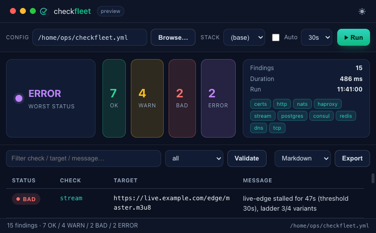
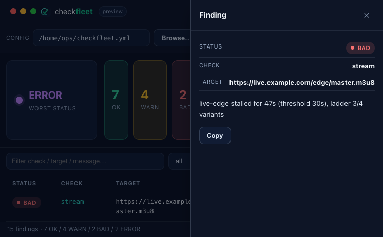
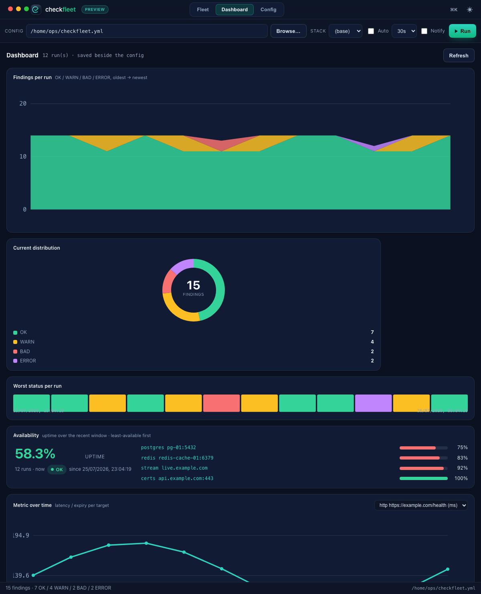
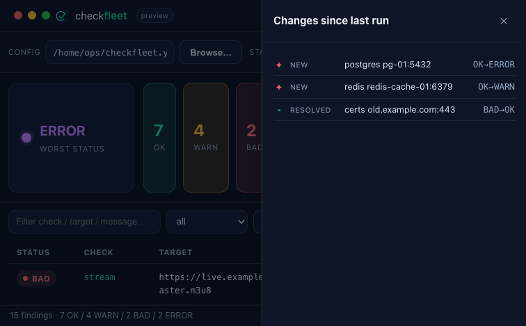
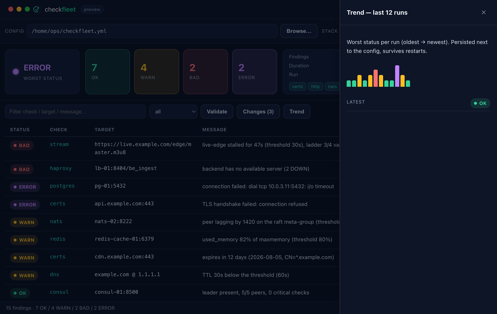
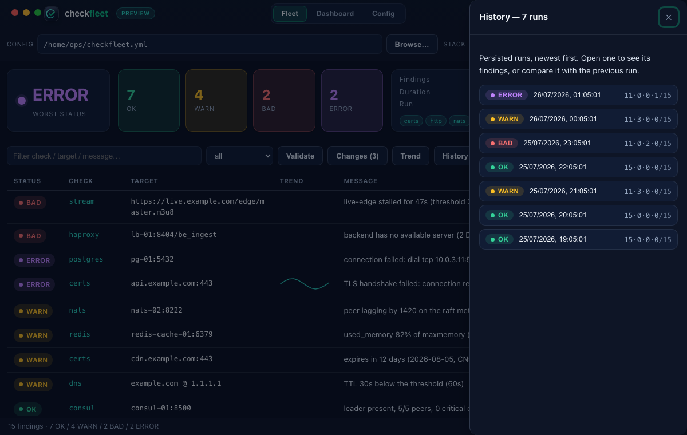
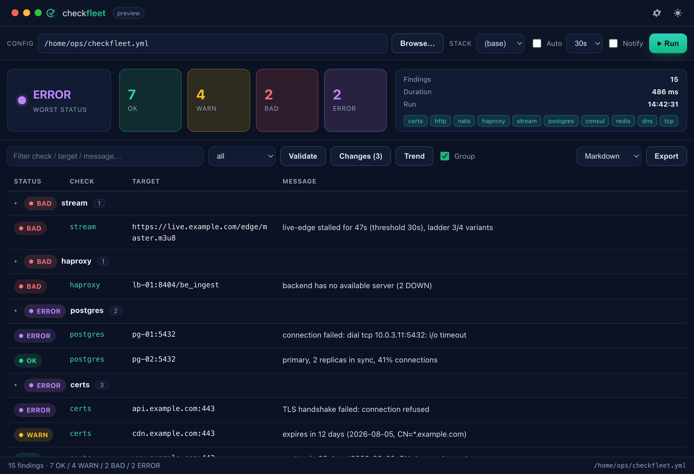
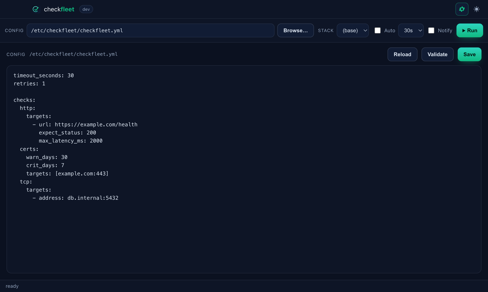
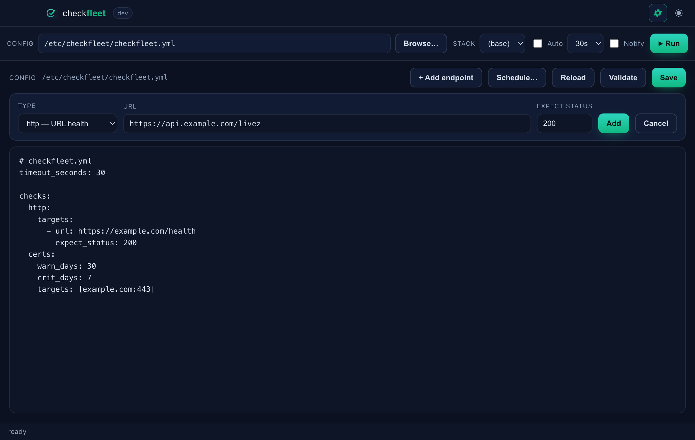
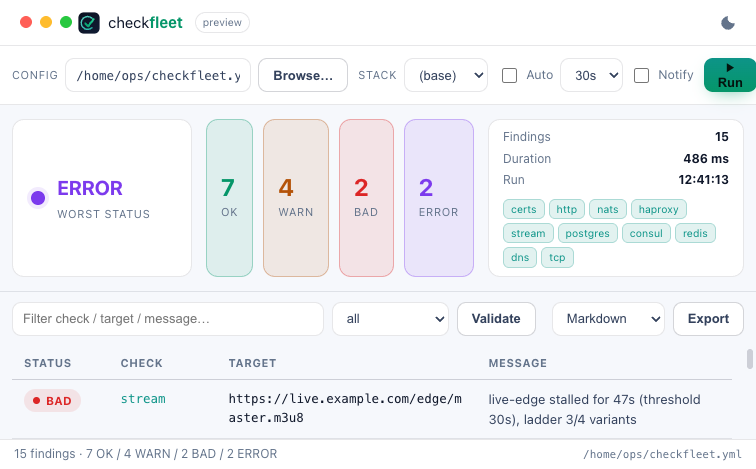

A small desktop GUI over the same engine as the CLI. It's a [Wails](https://wails.io)
app — a single native binary (macOS `.app`, Linux, Windows) with the web
frontend embedded — that **reuses `internal/engine`**: the checks, the
worst-first sort and the findings are identical to `checkfleet check all`. The
CLI stays the source of truth; the GUI is just another frontend.



## Views, command palette & shortcuts

The titlebar switches between three views:

- **Fleet** — the run summary and findings table (below).
- **Dashboard** — charts over the persisted history (see [Dashboard](#dashboard)).
- **Config** — the YAML editor for the selected file (see [Edit the config](#edit-the-config)).

The **command palette** (`⌘K` / `Ctrl-K`) is a searchable list of every action —
Run, Go to Fleet / Dashboard / Config, Focus filter, Validate, Show trend,
Export as Markdown / JSON / HTML, Toggle theme — navigable with the arrow keys
and **Enter**.

### Keyboard shortcuts

| Key | Action |
|-----|--------|
| `⌘K` / `Ctrl-K` | Open the command palette |
| `⌘↵` / `Ctrl-↵` | Run the checks |
| `1` / `2` / `3` | Switch to Fleet / Dashboard / Config |
| `/` | Focus the filter box |
| `r` | Run the checks |
| `Esc` | Close the palette or any open drawer |

Long actions (a run, a history read) show a thin **progress bar** under the
toolbar and a spinner on **Run**; the outcome of an action (exported, config
saved, validated) pops a non-blocking **toast** in the corner. Empty and error
states are explicit — a first run shows a loading state, a config that can't run
shows an inline error card with **Retry** and **Open config editor**. The whole
app respects `prefers-reduced-motion` and is keyboard-navigable (focus rings,
focus-trapped dialogs, ARIA roles).

## The fleet view

Everything is one screen, scanned top-to-bottom.

**Toolbar**

- **Config** — the `checkfleet.yml` to run. Type a path or **Browse…** for a
  native file picker.
- **Stack** — pick a `checkfleet.<stack>.yml` profile discovered next to the
  config (same overlay as the CLI's `--stack`); `(base)` runs the base file.
- **Auto** + interval — re-run the checks on a timer (10s / 30s / 60s / 5m).
- **Notify** — pop a native OS notification after a run whose worst status is
  BAD/ERROR.
- **Run** — execute every configured module now.

The app remembers your config path, stack, interval, Auto and Notify between
launches.

**Summary**

- The **worst status** pill (OK / WARN / BAD / ERROR) — the one thing to read
  first.
- Count tiles for **OK / WARN / BAD / ERROR**.
- Total findings, run **duration**, run time, and a chip per configured module.

**Findings table**

- One row per finding, **worst-first** (same order as the CLI), with a colored
  status badge and the `Status / Check / Target / Trend / Message` columns.
- The **Trend** column draws a tiny inline sparkline of that target's numeric
  metric (latency, days-to-expiry, lag…) from the history, for the checks that
  measure one.
- **Filter** box — live substring match over check, target and message.
- **Severity** dropdown — show all, or only `≥ WARN`, `≥ BAD`, `ERROR`.

**Export**

- **Export** — pick a format (Markdown, JSON, HTML, JUnit, Prometheus, OTLP) and
  save the current run via a native save dialog. Same renderers as the CLI's
  `--output`.

## Send to a chat or webhook

Beyond saving a file, **Send…** posts the current run straight to a chat or
webhook, reusing the same renderers as the CLI's `--output`. Pick a target —
**Slack**, **Discord**, **Teams** or a generic **Webhook** (JSON) — and click
**Send…**; a toast reports whether it went.

The destination URL is **never entered in the app** — it comes only from an
environment variable, so no secret lives in the GUI or its settings:

| Target | Env var |
|--------|---------|
| Slack | `SLACK_WEBHOOK` |
| Discord | `DISCORD_WEBHOOK` |
| Teams | `TEAMS_WEBHOOK` |
| Webhook (generic JSON) | `CHECKFLEET_WEBHOOK` |

If the target's env var isn't set, the toast tells you which one to set instead
of sending anything.

## Details, validate & explain

Click a finding row to open a **detail drawer** with the full message and a
**Copy** button. Click a **module chip** in the summary to see what that check
verifies (**Explain**), and the **Validate** button checks the config without
running anything (the same problems as `checkfleet validate`).



## Dashboard

The **Dashboard** view charts the persisted history (each Run is appended next
to the config), so you see how the fleet behaves over time rather than just now:

- **Findings per run** — a stacked-area timeline of the OK/WARN/BAD/ERROR counts
  across recent runs.
- **Current distribution** — a donut of the latest run's status split.
- **Worst status per run** — a compact color band, oldest → newest.
- **By module** — a module × run **heatmap**, color-coded by each module's worst
  status; click a row to drill into that module's trend.
- **Availability** — fleet **uptime** (share of runs that were all-OK) over the
  window, how long the current status has held, and the least-available targets
  with an SLO meter.
- **Metric over time** — a line chart of a numeric metric (latency, days-to-expiry,
  replication lag…) for a chosen target; hover a point for the value. A
  metric-bearing finding's detail drawer shows the same line inline.

Every chart is hand-drawn inline SVG — no chart library, no CDN — and follows
the light/dark theme. The Dashboard refreshes after each Run.



## Changes since the last run

After a second run, **Changes (N)** opens a drawer with only what moved — new,
resolved, worsened or improved findings — so you see the delta at a glance
during an incident (in-session, no history file needed).



## Trend over time

**Changes** is in-session only. **Trend** is persistent: every run is appended to
a small history file next to the config (`.<name>.history.jsonl`), and the button
opens a sparkline of the **worst status per run** — green/yellow/red/purple bars,
oldest to newest — so you can see a fleet degrade (or recover) across restarts.
Hover a bar for the timestamp and the OK/WARN/BAD/ERROR breakdown.



## History browser

**Trend** shows worst-status bars; **History** browses the runs themselves. The
button opens a drawer listing every persisted run — newest first, each with its
worst-status badge, timestamp and OK/WARN/BAD/ERROR counts. Open a run to see
its findings (status and numeric value — the compact history file doesn't store
messages), and **Compare with previous** shows exactly what changed versus the
run before it (new / resolved / worsened / improved) — the same delta as
**Changes**, but between historical runs.



## Group by module

Tick **Group** to fold the findings table into collapsible sections, one per
module, each with a rollup badge showing the module's worst status and how many
findings it has. Click a section header to collapse it — handy when a fleet has
many targets and you want to scan module-by-module. The choice is remembered
between restarts.



## Edit the config

The **Config** tab (titlebar) opens a full-panel YAML editor on the selected
`checkfleet.yml`:

- **Reload** — re-read the file from disk, discarding unsaved edits.
- **Validate** — check the *unsaved* text (YAML parse + domain rules) and list
  any problems inline, without saving. This runs the same validation as the CLI.
- **Save** — write the text back to the file.

Once saved, run the fleet from the GUI, or point cron / `checkfleet serve
--interval` at the same file — the config is the single source, and the app is
just one way to edit and run it.



### Add an endpoint

You don't have to hand-write YAML. **+ Add endpoint** opens a quick form for the
common checks — **http** (URL + expected status), **certs** / **tls**
(`host:443`), **tcp** / **smtp** (`host:port`), **dns** (name + record type),
**redis** / **nats** (`host:port`), **grpc** (`host:port` + optional service) and
**postgres** (DSN + optional password-env var). Pick a type, fill the field(s)
and **Add**: the endpoint is merged into the YAML (existing comments and
formatting are preserved), ready to review and **Save**. Secrets are never
entered here — for `postgres` you give the *name* of the env var that holds the
password, not the password itself.

As you type in the editor, a **live validity badge** next to the path shows
`✓ valid` or `✕ N problems` (hover for the details) — the same checks as the
**Validate** button, run against the unsaved text, so you catch a broken edit
immediately.



### Run it on a schedule

**Schedule…** prints copy-paste commands to run the same config unattended — a
`cron` line and a `checkfleet serve` command for the current file and interval —
so the app and your automation share one source of truth:

```cron
# run every 5 min:
*/5 * * * * checkfleet check all --config /etc/checkfleet/checkfleet.yml --exit-on-bad
```
```bash
# or run continuously as a Prometheus exporter:
checkfleet serve --config /etc/checkfleet/checkfleet.yml --interval 5m --listen :9876
```

## Light theme

The theme toggle (top-right) switches light/dark and remembers your choice.



## Open straight into a fleet

Two environment variables let the app open on a config and run immediately —
handy for an "open with" launcher or a kiosk view:

```bash
CHECKFLEET_CONFIG=/etc/checkfleet.yml CHECKFLEET_AUTORUN=1 checkfleet-desktop
```

Without them the app opens on `./checkfleet.yml` (if present) and waits for you
to press **Run**.

## Get it

Every [release](https://github.com/Allan-Nava/checkfleet/releases) attaches the
desktop builds next to the CLI archives:

- `checkfleet-desktop_<version>_darwin_universal.zip` — macOS `.app` (Intel +
  Apple Silicon)
- `checkfleet-desktop_<version>_linux_amd64.tar.gz`
- `checkfleet-desktop_<version>_windows_amd64.zip`

> The desktop binaries are unsigned for now — on macOS, right-click → **Open**
> the first time (or clear the quarantine attribute).

### Build from source

Requires the [Wails v2 toolchain](https://wails.io/docs/gettingstarted/installation)
and its platform prerequisites (macOS: Xcode command-line tools; Linux:
`libgtk-3` + `libwebkit2gtk-4.1`). Node is not needed — the frontend is static.

```bash
cd desktop
go mod tidy
wails dev                                   # hot-reload dev app
wails build -platform darwin/universal      # or linux/amd64, windows/amd64
```

The app lives in [`desktop/`](https://github.com/Allan-Nava/checkfleet/tree/main/desktop)
as a separate Go module, so the Wails toolchain never enters the CLI's build.
